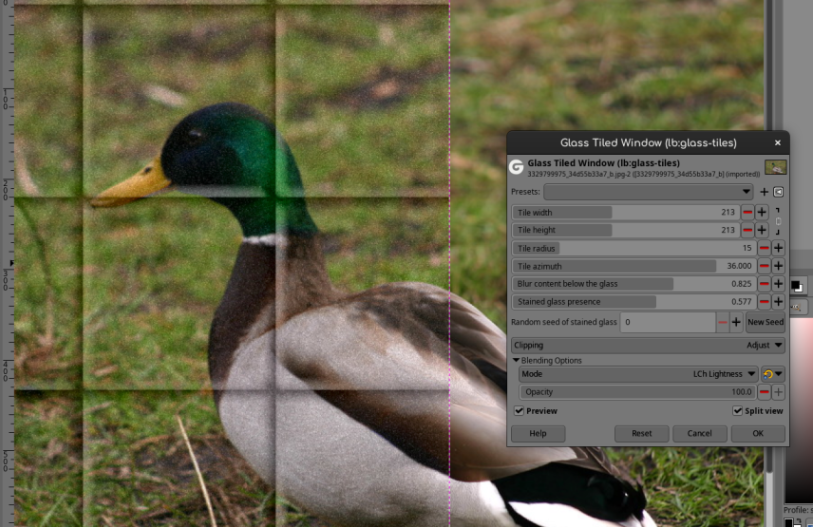
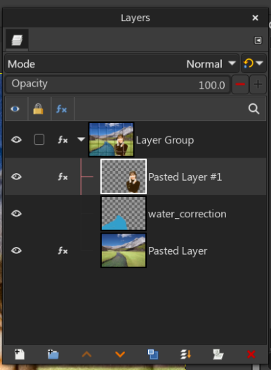

# Glass Tiled Window GIMP Plugin



Glass Tiles as a layer group effect in GIMP 2.99.19
it applies to everything inside the layer group.





## Directory to put Binaries (They do NOT go in the normal plugins folder)

**Windows**

 C:\Users\(USERNAME)\AppData\Local\gegl-0.4\plug-ins

 **Linux**

 /home/(USERNAME)/.local/share/gegl-0.4/plug-ins

 **Linux (Flatpak includes Chromebook)**

 /home/(USERNAME)/.var/app/org.gimp.GIMP/data/gegl-0.4/plug-ins

Then Restart Gimp and go to GEGL Operations and look for "Glass Tiled Window" in the drop down list
Gimp 2.99.16+ users will find the filter in filters>light and shadow>Glass Tiled Window. 2.10
users will only see it in the GEGL operations drop down list.


## Compiling and Installing

### Linux

To compile and install you will need the GEGL header files (`libgegl-dev` on
Debian based distributions or `gegl` on Arch Linux) and meson (`meson` on
most distributions).

```bash
meson setup --buildtype=release build
ninja -C build

```

### Windows

The easiest way to compile this project on Windows is by using msys2.  Download
and install it from here: https://www.msys2.org/

Open a msys2 terminal with `C:\msys64\mingw64.exe`.  Run the following to
install required build dependencies:

```bash
pacman --noconfirm -S base-devel mingw-w64-x86_64-toolchain mingw-w64-x86_64-meson mingw-w64-x86_64-gegl
```

Then build the same way you would on Linux:

```bash
meson setup --buildtype=release build
ninja -C build
```
